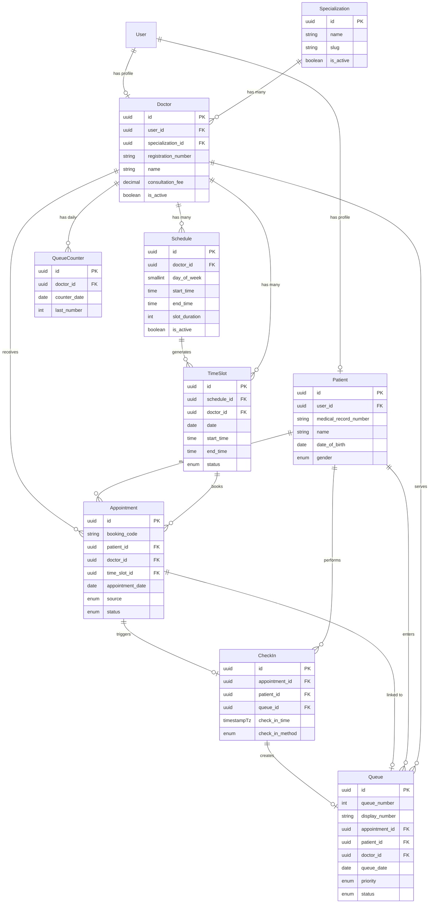
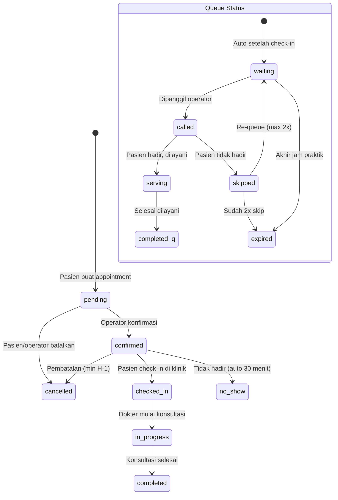

# Product Requirements Document (PRD)
## Sistem Informasi Layanan Klinik Sehat Sentosa

| | |
|--|--|
| **Nama Sistem** | Sistem Informasi Layanan Klinik Sehat Sentosa |
| **Tanggal** | 3 September 2026 |
| **Penyusun** | Tim Pengembang — Divisi IT |
| **Instansi** | Klinik Sehat Sentosa |

---

## Ringkasan Sistem

> *Jelaskan dalam 2–4 kalimat: apa sistemnya, untuk siapa, dan manfaat utamanya.*

Klinik Sehat Sentosa membutuhkan sistem digital terpadu untuk mengelola layanan **jadwal praktik dokter, perjanjian (appointment) pasien, check-in, dan antrian layanan klinik**. Sistem ini memudahkan pasien membuat janji temu dokter secara online, membantu staf administrasi mengelola jadwal dan antrian secara efisien, serta memberikan pimpinan laporan operasional real-time. Target: memangkas waktu proses pendaftaran dan antrian dari **rata-rata 45 menit (manual)** menjadi **di bawah 10 menit (digital)**.

---

## Arsitektur & Teknologi

### Stack Teknologi

| Komponen | Teknologi | Versi | Keterangan |
|----------|-----------|-------|------------|
| **Bahasa** | PHP | ≥ 8.3 | Versi minimum yang didukung Laravel 13 |
| **Framework** | [Laravel](https://laravel.com/) | v13 | Full-stack PHP framework |
| **Admin Panel** | [Filament](https://filamentphp.com/) | v5 | UI framework berbasis TALL Stack (Tailwind CSS, Alpine.js, Livewire, Laravel) |
| **Database** | PostgreSQL | ≥ 16 | RDBMS utama untuk seluruh data aplikasi |
| **Frontend** | TALL Stack | — | Tailwind CSS + Alpine.js + Livewire (bawaan Filament) |

### Arsitektur Database — PostgreSQL

> *Gunakan PostgreSQL sebagai satu-satunya RDBMS. Manfaatkan fitur-fitur native PostgreSQL berikut sesuai kebutuhan:*

| Fitur PostgreSQL | Kegunaan dalam Sistem |
|------------------|-----------------------|
| **UUID** (`uuid` / `ulid`) | Primary key yang aman untuk entitas publik (appointment, antrian, invoice) |
| **JSONB** | Menyimpan data dinamis/metadata fleksibel (contoh: detail gejala pasien, catatan dokter) |
| **Full-Text Search** (`tsvector`) | Pencarian cepat pada data pasien, dokter, dan jadwal |
| **Enum Types** | Status appointment (`pending`, `confirmed`, `checked_in`, `in_progress`, `completed`, `cancelled`) |
| **Partial Index** | Index kondisional untuk query yang sering diakses (contoh: antrian hari ini) |
| **Foreign Key Constraints** | Integritas referensial antar tabel |
| **Timestamp with Time Zone** | Konsistensi waktu lintas zona (penting untuk jadwal dokter) |

### Struktur Panel Filament v5

> *Filament v5 mendukung multi-panel. Definisikan panel sesuai peran pengguna.*

| Panel | Path | Peran Pengguna | Deskripsi |
|-------|------|----------------|-----------|
| **Admin** | `/admin` | Administrator, Operator Klinik | Kelola seluruh data master, CRUD Resources, manajemen pengguna, jadwal dokter, antrian |
| **Pimpinan** | `/pimpinan` | Kepala Klinik / Direktur | Dashboard read-only, laporan kunjungan, statistik layanan |
| **Portal Pasien** | `/portal` | Pasien | Buat appointment, cek jadwal dokter, check-in online, lihat status antrian |

### Komponen Filament v5 yang Digunakan

| Komponen | Fungsi |
|----------|--------|
| **Resources** | CRUD untuk setiap entitas utama (Doctor, Schedule, Appointment, Queue, Specialization) |
| **Relation Managers** | Mengelola relasi (contoh: Schedule dalam Doctor, Appointment dalam Patient) |
| **Dashboard Widgets** | Stat widgets untuk jumlah kunjungan hari ini, chart tren appointment mingguan |
| **Actions & Modals** | Konfirmasi aksi: approve appointment, check-in pasien, panggil antrian berikutnya |
| **Notifications** | Notifikasi in-app untuk perubahan status appointment dan pemanggilan antrian |
| **Tables** | Tabel data dengan filter, sort, search, dan bulk actions |
| **Forms** | Form builder dengan validasi, conditional fields, dan file upload |
| **Infolists** | Tampilan detail read-only untuk profil pasien dan riwayat kunjungan |
| **Custom Pages** | Halaman khusus: kalender jadwal dokter, display antrian real-time, laporan cetak |

---

## 1. Pengguna Sistem

| Peran | Siapa | Yang Mereka Lakukan | Panel Filament |
|-------|-------|---------------------|----------------|
| **Administrator** | Staf TI Klinik | Kelola seluruh data master, hak akses pengguna, konfigurasi sistem | Admin |
| **Operator Klinik** | Staf resepsionis / front-office | Input jadwal dokter, konfirmasi appointment, proses check-in, kelola antrian | Admin |
| **Dokter** | Dokter praktik | Lihat jadwal praktik sendiri, lihat daftar pasien hari ini, update status konsultasi | Admin (akses terbatas) |
| **Pimpinan** | Kepala Klinik / Direktur | Lihat dashboard dan laporan — hanya baca | Pimpinan |
| **Pasien** | Masyarakat umum | Lihat jadwal dokter, buat appointment, check-in online, pantau antrian | Portal Pasien |

---

## 2. Layanan yang Dikelola Sistem

> *Untuk setiap layanan: jelaskan alurnya dan data apa yang perlu dicatat.*
> *Aturan bisnis penting wajib dituliskan — ini yang akan menjadi validasi di sistem.*

---

### Layanan 1 — Jadwal Dokter (Doctor Schedule Management)

**Deskripsi:** Pengelolaan jadwal praktik dokter di klinik. Administrator/operator dapat mengatur hari dan jam praktik setiap dokter berdasarkan spesialisasi, serta mengelola slot waktu yang tersedia untuk appointment pasien.

**Alur:**
1. Administrator mendaftarkan data dokter baru beserta spesialisasinya
2. Operator membuat jadwal praktik mingguan untuk setiap dokter (hari, jam mulai, jam selesai, durasi per slot)
3. Sistem otomatis membuat slot waktu (time slots) berdasarkan jadwal yang dibuat
4. Dokter atau operator dapat menonaktifkan jadwal tertentu (libur, cuti, dll)
5. Pasien dapat melihat jadwal dokter yang tersedia melalui portal

**Data yang dicatat:** nama dokter · spesialisasi · hari praktik · jam mulai · jam selesai · durasi slot (menit) · kuota per slot · status jadwal (aktif/nonaktif) · alasan nonaktif

**Aturan bisnis:**
- Satu dokter **tidak boleh memiliki jadwal yang overlap** di hari dan jam yang sama
- Durasi slot minimal **10 menit** dan maksimal **60 menit**
- Jadwal yang dinonaktifkan **secara otomatis membatalkan** appointment yang belum dikonfirmasi pada jadwal tersebut
- Perubahan jadwal hanya berlaku untuk **H+1 ke depan**, tidak bisa mengubah jadwal hari berjalan yang sudah memiliki appointment

#### Model & Tabel Database

| Model (Eloquent) | Tabel Database | Deskripsi |
|-------------------|----------------|-----------|
| `Specialization` | `specializations` | Data spesialisasi dokter (Umum, Gigi, Anak, dll) |
| `Doctor` | `doctors` | Data dokter beserta relasi ke User dan Specialization |
| `Schedule` | `schedules` | Jadwal praktik mingguan dokter (hari, jam mulai/selesai) |
| `TimeSlot` | `time_slots` | Slot waktu spesifik yang tersedia untuk booking |

#### Struktur Tabel

**`specializations`**

| Kolom | Tipe | Keterangan |
|-------|------|------------|
| `id` | `uuid` | Primary key |
| `name` | `string` | Nama spesialisasi (contoh: "Dokter Umum") |
| `slug` | `string` | Slug URL-friendly, unique |
| `description` | `text`, nullable | Deskripsi spesialisasi |
| `icon` | `string`, nullable | Ikon untuk tampilan UI |
| `is_active` | `boolean`, default `true` | Status aktif |
| `created_at` | `timestampTz` | Waktu dibuat |
| `updated_at` | `timestampTz` | Waktu diperbarui |

**`doctors`**

| Kolom | Tipe | Keterangan |
|-------|------|------------|
| `id` | `uuid` | Primary key |
| `user_id` | `foreignUuid` → `users.id` | Relasi ke tabel users |
| `specialization_id` | `foreignUuid` → `specializations.id` | Relasi ke spesialisasi |
| `registration_number` | `string`, unique | Nomor STR / SIP dokter |
| `name` | `string` | Nama lengkap dokter (denormalisasi untuk performa) |
| `phone` | `string`, nullable | Nomor telepon dokter |
| `bio` | `text`, nullable | Profil singkat dokter |
| `photo` | `string`, nullable | Path foto profil |
| `consultation_fee` | `decimal(12,2)` | Biaya konsultasi dasar |
| `is_active` | `boolean`, default `true` | Status aktif praktik |
| `metadata` | `jsonb`, nullable | Data tambahan fleksibel |
| `created_at` | `timestampTz` | Waktu dibuat |
| `updated_at` | `timestampTz` | Waktu diperbarui |

**`schedules`**

| Kolom | Tipe | Keterangan |
|-------|------|------------|
| `id` | `uuid` | Primary key |
| `doctor_id` | `foreignUuid` → `doctors.id` | Relasi ke dokter |
| `day_of_week` | `smallInteger` | Hari dalam seminggu (0=Minggu, 1=Senin, ..., 6=Sabtu) |
| `start_time` | `time` | Jam mulai praktik |
| `end_time` | `time` | Jam selesai praktik |
| `slot_duration` | `integer` | Durasi per slot dalam menit (default: 15) |
| `max_patients_per_slot` | `integer`, default `1` | Kuota pasien per slot |
| `is_active` | `boolean`, default `true` | Status aktif jadwal |
| `effective_date` | `date` | Tanggal mulai berlaku jadwal |
| `end_date` | `date`, nullable | Tanggal berakhir jadwal (null = tanpa batas) |
| `created_at` | `timestampTz` | Waktu dibuat |
| `updated_at` | `timestampTz` | Waktu diperbarui |

**`time_slots`**

| Kolom | Tipe | Keterangan |
|-------|------|------------|
| `id` | `uuid` | Primary key |
| `schedule_id` | `foreignUuid` → `schedules.id` | Relasi ke jadwal |
| `doctor_id` | `foreignUuid` → `doctors.id` | Relasi ke dokter (denormalisasi) |
| `date` | `date` | Tanggal slot |
| `start_time` | `time` | Jam mulai slot |
| `end_time` | `time` | Jam selesai slot |
| `max_patients` | `integer`, default `1` | Kuota pasien |
| `booked_count` | `integer`, default `0` | Jumlah yang sudah booking |
| `status` | `enum('available','full','blocked','closed')` | Status ketersediaan slot |
| `blocked_reason` | `string`, nullable | Alasan jika slot diblokir |
| `created_at` | `timestampTz` | Waktu dibuat |
| `updated_at` | `timestampTz` | Waktu diperbarui |

**Index:** `unique(schedule_id, date, start_time)` · `index(doctor_id, date, status)` — partial index pada `status = 'available'`

---

### Layanan 2 — Perjanjian / Appointment Dokter (Doctor Appointment)

**Deskripsi:** Pasien dapat membuat janji temu dengan dokter secara online melalui portal, atau didaftarkan oleh operator klinik. Appointment terkait dengan slot waktu tertentu pada jadwal dokter.

**Alur:**
1. Pasien login ke portal dan memilih spesialisasi/dokter yang diinginkan
2. Pasien melihat jadwal dan memilih slot waktu yang tersedia
3. Pasien mengisi formulir appointment (keluhan, riwayat alergi)
4. Sistem membuat appointment dengan status `pending`
5. Operator/sistem mengkonfirmasi appointment → status berubah menjadi `confirmed`
6. Pasien menerima notifikasi konfirmasi beserta nomor booking
7. Pasien dapat membatalkan appointment melalui portal (minimal H-1)

**Data yang dicatat:** nomor booking · nama pasien · dokter yang dipilih · slot waktu · keluhan/gejala · riwayat alergi · status appointment · sumber pendaftaran (online/walk-in) · catatan operator

**Aturan bisnis:**
- Satu pasien **tidak bisa membuat lebih dari 1 appointment aktif** pada dokter yang sama di hari yang sama
- Appointment hanya bisa dibuat pada slot dengan status `available` dan `booked_count < max_patients`
- Setelah appointment dibuat, `booked_count` pada `time_slots` **otomatis bertambah**; jika penuh, status slot berubah ke `full`
- Pembatalan oleh pasien hanya bisa dilakukan **minimal 2 jam sebelum** waktu appointment
- Appointment yang tidak di-check-in dalam **30 menit** setelah waktu slot dimulai, otomatis berubah ke status `no_show`
- Appointment walk-in langsung berstatus `confirmed`

#### Model & Tabel Database

| Model (Eloquent) | Tabel Database | Deskripsi |
|-------------------|----------------|-----------|
| `Patient` | `patients` | Data pasien (profil medis dasar) |
| `Appointment` | `appointments` | Data perjanjian/appointment pasien |

#### Struktur Tabel

**`patients`**

| Kolom | Tipe | Keterangan |
|-------|------|------------|
| `id` | `uuid` | Primary key |
| `user_id` | `foreignUuid` → `users.id`, nullable | Relasi ke tabel users (null jika belum registrasi akun) |
| `medical_record_number` | `string`, unique | Nomor rekam medis, auto-generated |
| `name` | `string` | Nama lengkap pasien |
| `identity_number` | `string`, nullable | NIK / nomor identitas |
| `date_of_birth` | `date` | Tanggal lahir |
| `gender` | `enum('male','female')` | Jenis kelamin |
| `phone` | `string` | Nomor telepon |
| `email` | `string`, nullable | Alamat email |
| `address` | `text`, nullable | Alamat lengkap |
| `blood_type` | `enum('A','B','AB','O')`, nullable | Golongan darah |
| `allergies` | `jsonb`, nullable | Daftar alergi (format array JSON) |
| `emergency_contact_name` | `string`, nullable | Nama kontak darurat |
| `emergency_contact_phone` | `string`, nullable | Telepon kontak darurat |
| `metadata` | `jsonb`, nullable | Data tambahan fleksibel |
| `created_at` | `timestampTz` | Waktu dibuat |
| `updated_at` | `timestampTz` | Waktu diperbarui |

**`appointments`**

| Kolom | Tipe | Keterangan |
|-------|------|------------|
| `id` | `uuid` | Primary key |
| `booking_code` | `string`, unique | Kode booking unik (contoh: APT-20260903-001) |
| `patient_id` | `foreignUuid` → `patients.id` | Relasi ke pasien |
| `doctor_id` | `foreignUuid` → `doctors.id` | Relasi ke dokter |
| `time_slot_id` | `foreignUuid` → `time_slots.id` | Relasi ke slot waktu |
| `appointment_date` | `date` | Tanggal appointment |
| `start_time` | `time` | Jam mulai (denormalisasi dari time_slot) |
| `complaint` | `text`, nullable | Keluhan / gejala pasien |
| `notes` | `text`, nullable | Catatan tambahan dari operator/pasien |
| `source` | `enum('online','walk_in','phone')` | Sumber pendaftaran |
| `status` | `enum('pending','confirmed','checked_in','in_progress','completed','cancelled','no_show')` | Status appointment |
| `cancelled_at` | `timestampTz`, nullable | Waktu pembatalan |
| `cancelled_by` | `foreignUuid` → `users.id`, nullable | Siapa yang membatalkan |
| `cancellation_reason` | `string`, nullable | Alasan pembatalan |
| `metadata` | `jsonb`, nullable | Data tambahan fleksibel |
| `created_at` | `timestampTz` | Waktu dibuat |
| `updated_at` | `timestampTz` | Waktu diperbarui |

**Index:** `unique(patient_id, doctor_id, appointment_date)` WHERE `status NOT IN ('cancelled','completed','no_show')` · `index(doctor_id, appointment_date, status)` · `index(booking_code)`

---

### Layanan 3 — Check-in Pasien (Patient Check-in)

**Deskripsi:** Proses registrasi kedatangan pasien di klinik, baik yang sudah memiliki appointment maupun pasien walk-in. Check-in mengonfirmasi kehadiran pasien dan secara otomatis memasukkan pasien ke dalam antrian layanan.

**Alur:**
1. Pasien tiba di klinik dan melakukan check-in (via portal online, kiosk, atau dibantu operator)
2. Jika pasien memiliki appointment: sistem memvalidasi appointment dan mengubah status menjadi `checked_in`
3. Jika pasien walk-in: operator membuat appointment baru (status langsung `confirmed`) lalu check-in
4. Sistem otomatis membuat entri antrian (queue) dengan nomor urut
5. Pasien menerima nomor antrian dan estimasi waktu tunggu
6. Status check-in dicatat dengan timestamp kedatangan

**Data yang dicatat:** appointment terkait · waktu check-in · metode check-in (online/kiosk/operator) · nomor antrian yang diterbitkan · vital signs awal (opsional: tekanan darah, suhu, berat badan)

**Aturan bisnis:**
- Check-in hanya bisa dilakukan **maksimal 60 menit sebelum** dan **30 menit setelah** waktu appointment dimulai
- Pasien yang sudah check-in **tidak bisa check-in ulang** untuk appointment yang sama
- Check-in otomatis membuat **entri antrian baru** pada layanan dokter terkait
- Pasien walk-in yang check-in tanpa appointment akan **otomatis ditempatkan di slot terdekat** yang tersedia

#### Model & Tabel Database

| Model (Eloquent) | Tabel Database | Deskripsi |
|-------------------|----------------|-----------|
| `CheckIn` | `check_ins` | Data check-in/registrasi kedatangan pasien |

#### Struktur Tabel

**`check_ins`**

| Kolom | Tipe | Keterangan |
|-------|------|------------|
| `id` | `uuid` | Primary key |
| `appointment_id` | `foreignUuid` → `appointments.id` | Relasi ke appointment |
| `patient_id` | `foreignUuid` → `patients.id` | Relasi ke pasien (denormalisasi) |
| `queue_id` | `foreignUuid` → `queues.id`, nullable | Relasi ke antrian yang dibuat |
| `check_in_time` | `timestampTz` | Waktu check-in |
| `check_in_method` | `enum('online','kiosk','operator')` | Metode check-in |
| `checked_in_by` | `foreignUuid` → `users.id`, nullable | User yang memproses (null jika self check-in) |
| `vital_signs` | `jsonb`, nullable | Data vital signs (BP, temp, weight, height) |
| `notes` | `text`, nullable | Catatan saat check-in |
| `created_at` | `timestampTz` | Waktu dibuat |
| `updated_at` | `timestampTz` | Waktu diperbarui |

**Index:** `unique(appointment_id)` · `index(patient_id, check_in_time)` · `index(check_in_time)`

---

### Layanan 4 — Antrian Layanan (Service Queue Management)

**Deskripsi:** Sistem manajemen antrian real-time yang mengatur urutan pelayanan pasien di setiap poli/ruang dokter. Antrian dikelola per dokter per hari, dengan tampilan display antrian untuk ruang tunggu.

**Alur:**
1. Setelah pasien check-in, sistem otomatis membuat entri antrian dengan nomor urut
2. Antrian dikelompokkan per dokter (per poli) per hari
3. Dokter atau operator memanggil antrian berikutnya → status berubah dari `waiting` ke `serving`
4. Setelah konsultasi selesai, status antrian berubah ke `completed`
5. Pasien yang tidak hadir saat dipanggil dapat di-skip → status `skipped`
6. Pasien yang di-skip dapat dipanggil ulang (re-queue) di urutan terakhir
7. Display antrian real-time menampilkan nomor yang sedang dilayani dan daftar tunggu

**Data yang dicatat:** nomor antrian · dokter/poli tujuan · waktu masuk antrian · waktu dipanggil · waktu mulai dilayani · waktu selesai · durasi tunggu · durasi layanan · status antrian

**Aturan bisnis:**
- Nomor antrian **di-reset setiap hari** dan unik per dokter per hari
- Urutan antrian mengikuti prinsip **FIFO** (First In First Out), kecuali pasien prioritas (lansia, disabilitas, bayi/balita)
- Hanya **satu antrian berstatus `serving`** per dokter pada satu waktu
- Pasien yang di-skip **maksimal bisa dipanggil ulang 2 kali** sebelum otomatis menjadi `expired`
- Antrian yang masih `waiting` di akhir jam praktik dokter otomatis berstatus `expired`

#### Model & Tabel Database

| Model (Eloquent) | Tabel Database | Deskripsi |
|-------------------|----------------|-----------|
| `Queue` | `queues` | Data antrian layanan pasien |
| `QueueCounter` | `queue_counters` | Counter/penghitung nomor antrian harian per dokter |

#### Struktur Tabel

**`queues`**

| Kolom | Tipe | Keterangan |
|-------|------|------------|
| `id` | `uuid` | Primary key |
| `queue_number` | `integer` | Nomor urut antrian (per dokter per hari) |
| `display_number` | `string` | Nomor tampilan (contoh: "A-001", "B-015") |
| `appointment_id` | `foreignUuid` → `appointments.id` | Relasi ke appointment |
| `check_in_id` | `foreignUuid` → `check_ins.id` | Relasi ke check-in |
| `patient_id` | `foreignUuid` → `patients.id` | Relasi ke pasien |
| `doctor_id` | `foreignUuid` → `doctors.id` | Relasi ke dokter tujuan |
| `queue_date` | `date` | Tanggal antrian |
| `priority` | `enum('normal','priority')`, default `'normal'` | Tingkat prioritas |
| `priority_reason` | `string`, nullable | Alasan prioritas (lansia, disabilitas, dll) |
| `status` | `enum('waiting','called','serving','completed','skipped','expired')` | Status antrian |
| `called_at` | `timestampTz`, nullable | Waktu dipanggil |
| `serving_at` | `timestampTz`, nullable | Waktu mulai dilayani |
| `completed_at` | `timestampTz`, nullable | Waktu selesai dilayani |
| `skip_count` | `integer`, default `0` | Jumlah kali di-skip |
| `estimated_wait_minutes` | `integer`, nullable | Estimasi waktu tunggu (menit) |
| `actual_wait_minutes` | `integer`, nullable | Waktu tunggu aktual (menit) — computed |
| `actual_service_minutes` | `integer`, nullable | Durasi layanan aktual (menit) — computed |
| `notes` | `text`, nullable | Catatan antrian |
| `created_at` | `timestampTz` | Waktu dibuat |
| `updated_at` | `timestampTz` | Waktu diperbarui |

**`queue_counters`**

| Kolom | Tipe | Keterangan |
|-------|------|------------|
| `id` | `uuid` | Primary key |
| `doctor_id` | `foreignUuid` → `doctors.id` | Relasi ke dokter |
| `counter_date` | `date` | Tanggal counter |
| `prefix` | `string` | Prefix nomor antrian (contoh: "A", "B") |
| `last_number` | `integer`, default `0` | Nomor terakhir yang diterbitkan |
| `created_at` | `timestampTz` | Waktu dibuat |
| `updated_at` | `timestampTz` | Waktu diperbarui |

**Index:** `unique(doctor_id, queue_date, queue_number)` pada `queues` · `unique(doctor_id, counter_date)` pada `queue_counters` · `index(doctor_id, queue_date, status)` — partial index pada `status IN ('waiting','called','serving')`

---

## 3. Laporan & Dashboard yang Dibutuhkan

### Dashboard Utama (tampil saat login)

| Informasi | Keterangan |
|-----------|------------|
| Total kunjungan hari ini | Jumlah pasien yang sudah check-in hari ini per poli/dokter |
| Appointment menunggu konfirmasi | Jumlah appointment berstatus `pending` yang perlu dikonfirmasi |
| Antrian aktif saat ini | Jumlah pasien yang sedang mengantri (`waiting` + `called`) per dokter |
| Rata-rata waktu tunggu hari ini | Rata-rata durasi tunggu pasien dari check-in hingga dilayani |
| Dokter aktif hari ini | Daftar dokter yang sedang praktik beserta jumlah antrian masing-masing |
| Tingkat no-show minggu ini | Persentase appointment yang berstatus `no_show` dalam 7 hari terakhir |
| Tren appointment mingguan | Chart jumlah appointment per hari dalam 4 minggu terakhir |

### Laporan Berkala

| Laporan | Frekuensi | Isi | Format |
|---------|-----------|-----|--------|
| Rekap Kunjungan Pasien | Harian | Total kunjungan per dokter, per spesialisasi, per sumber (online/walk-in) | Excel & PDF |
| Statistik Appointment | Mingguan | Jumlah appointment per status, rasio konfirmasi, rasio no-show | PDF |
| Performa Antrian | Mingguan | Rata-rata waktu tunggu, rata-rata durasi layanan per dokter | Excel & PDF |
| Laporan Utilisasi Dokter | Bulanan | Persentase slot terisi vs tersedia per dokter, jumlah pasien dilayani | PDF |
| Rekap Operasional Klinik | Bulanan | Ringkasan seluruh layanan: total kunjungan, tren, perbandingan bulan sebelumnya | Excel & PDF |

---

## Ringkasan Model & Relasi

### Daftar Seluruh Model

| # | Model | Tabel | Primary Key | Deskripsi Singkat |
|---|-------|-------|-------------|-------------------|
| 1 | `User` | `users` | `id` (uuid) | Pengguna sistem (bawaan Laravel) |
| 2 | `Specialization` | `specializations` | `id` (uuid) | Spesialisasi dokter |
| 3 | `Doctor` | `doctors` | `id` (uuid) | Data dokter |
| 4 | `Schedule` | `schedules` | `id` (uuid) | Jadwal praktik mingguan |
| 5 | `TimeSlot` | `time_slots` | `id` (uuid) | Slot waktu per tanggal |
| 6 | `Patient` | `patients` | `id` (uuid) | Data pasien |
| 7 | `Appointment` | `appointments` | `id` (uuid) | Perjanjian / janji temu |
| 8 | `CheckIn` | `check_ins` | `id` (uuid) | Registrasi kedatangan |
| 9 | `Queue` | `queues` | `id` (uuid) | Antrian layanan |
| 10 | `QueueCounter` | `queue_counters` | `id` (uuid) | Counter nomor antrian harian |

### Diagram Relasi (ERD)

### Status Flow Diagram

---

> **Catatan untuk AI Coding Assistant:**
>
> **Stack & Arsitektur:**
> - Framework: **Laravel 13** dengan **Filament v5** (TALL Stack)
> - Database: **PostgreSQL ≥ 16** — gunakan migration Laravel dengan driver `pgsql`
> - Gunakan **UUID/ULID** sebagai primary key untuk seluruh entitas
> - Gunakan fitur **JSONB** PostgreSQL untuk metadata dinamis via Laravel `$casts`
> - Gunakan **Enum type** PostgreSQL untuk kolom status (atau string enum yang dicasting di Model)
>
> **Mapping PRD → Kode:**
> - **Layanan 1 (Jadwal Dokter)** → `SpecializationResource`, `DoctorResource`, `ScheduleResource`, `TimeSlotResource` + migration tabel `specializations`, `doctors`, `schedules`, `time_slots`
> - **Layanan 2 (Appointment)** → `PatientResource`, `AppointmentResource` + migration tabel `patients`, `appointments`
> - **Layanan 3 (Check-in)** → `CheckInResource` + migration tabel `check_ins` — Action class untuk proses check-in dan auto-create queue
> - **Layanan 4 (Antrian)** → `QueueResource`, `QueueCounterResource` + migration tabel `queues`, `queue_counters` — Custom page untuk display antrian real-time
> - Setiap **alur** → urutan status pada kolom `status` (enum) di tabel terkait
> - Setiap **data yang dicatat** → kolom-kolom pada migration + `$fillable` di Eloquent Model
> - Setiap **aturan bisnis** → validasi di Form schema Filament + business logic di Model/Action class
> - Setiap **peran pengguna** → Panel Filament terpisah dengan middleware auth + policy authorization
> - Bagian 3 (Dashboard) → `StatsOverviewWidget`, `ChartWidget` di dashboard Filament + fitur ekspor PDF/Excel
>
> **Naming Convention (Laravel Standard):**
> - Model: `PascalCase` singular — `Doctor`, `Appointment`, `CheckIn`, `Queue`, `TimeSlot`
> - Tabel: `snake_case` plural — `doctors`, `appointments`, `check_ins`, `queues`, `time_slots`
> - Foreign Key: `snake_case` singular + `_id` — `doctor_id`, `patient_id`, `time_slot_id`
> - Pivot Table: singular model names in alphabetical order — contoh: `doctor_specialization` (jika many-to-many)
>
> **Referensi:**
> - Dokumentasi Filament v5: https://filamentphp.com/docs
> - Dokumentasi Laravel: https://laravel.com/docs
> - Dokumentasi PostgreSQL: https://www.postgresql.org/docs/

---
